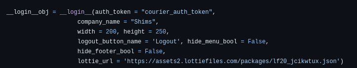
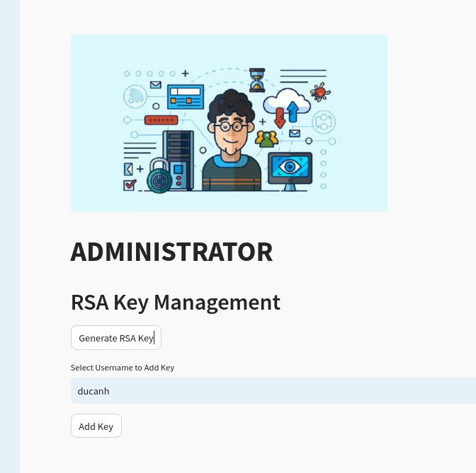
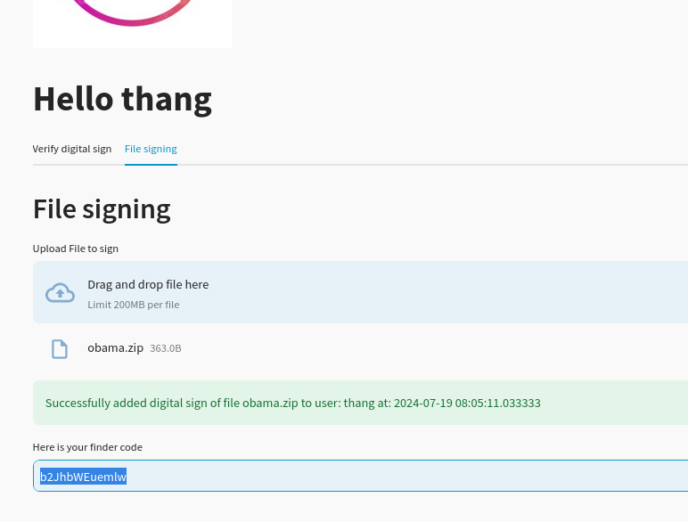
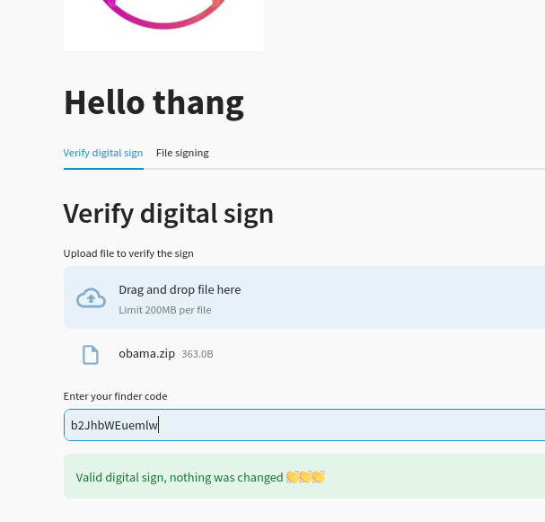

# RSA DIGITAL_SIGNING ONLINE SERVICE

This service offers RSA file-signing and verifying functions using python, [streamlit](https://docs.streamlit.io/get-started/installation) and [streamlit_login_auth_ui](https://github.com/GauriSP10/streamlit_login_auth_ui).
With the admin account (username:duc/password:duc), admin can generate the RSA keypairs for any users.
Logged in users who already had the keys can sign file (which afterwards will create a verification code). This verification code is then used to verify
any file to check the integrity.

## Table of Contents

- [Installation](#installation)
- [Settings](#Settings)
- [Usage](#usage)
- [Feature](#Feature)


## Installation

**Install all the libs in requirements.txt.**
**You can either download the zip version and unzip, then run the service using `streamlit run app.py` or using bash:**

```bash
# Clone the repository
git clone https://github.com/ducpro0712/rsasign

# Navigate to the project directory
cd your_repository

# Install dependencies
pip install -r requirements.txt

# Run the service
streamlit run app.py
```
## Settings

### There are 2 mandatory things you have to set up before using the service:



- **auth_token must be provided in app.py. This token is received when you create an account in [Courier](https://www.courier.com/email-api/) (After creating an acc, click on Settings -> Working Configuration -> API Keys. Your auth_token is the one name *published*)**

- **company_name: The name of admin/company who is the sender of the password-recovering email**


## Usage

### Admin account: duc/duc - could choose any registered-user to add a RSA keypair



### Registered users:

**1.  When signing the file, they will have a `finder code`, which is `b2JhbWEuemlw` in this example:**



**2.  When verifying, the users have to put in the `finder code`, which is only shared to them by the file sender:**



**3. !!! Only users have RSA keypair given by admin could do the above functions !!!**


## Feature
### Forgot password:
**- With the registered email, a temporary password will be sent to that user by admin through it**

